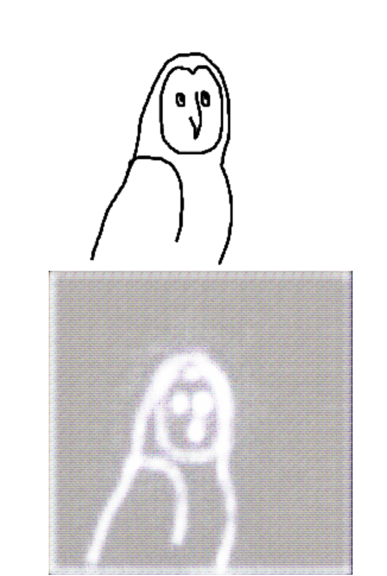
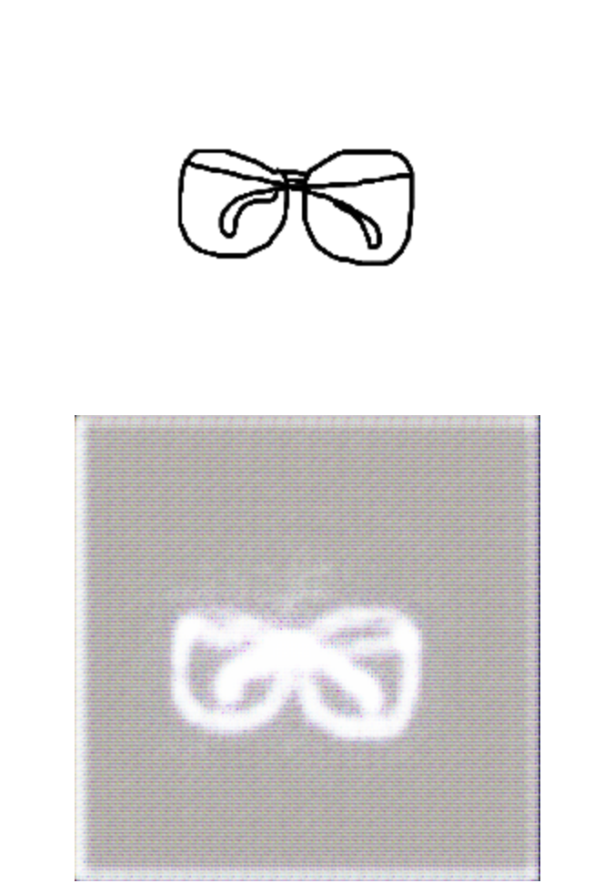
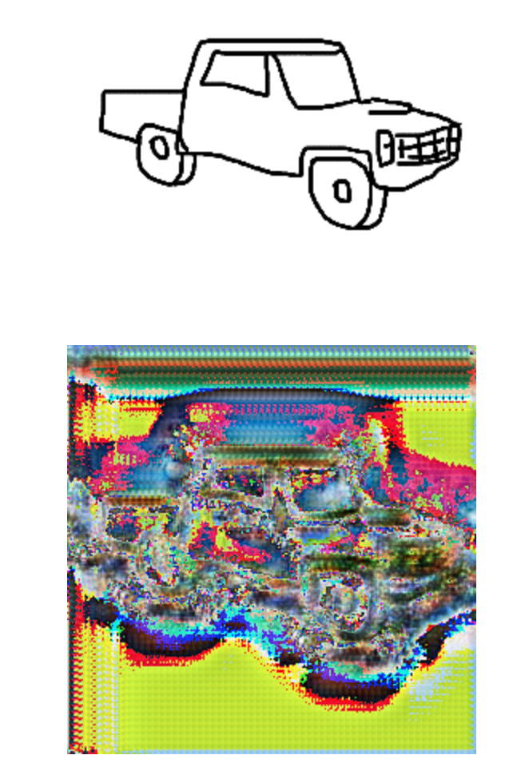
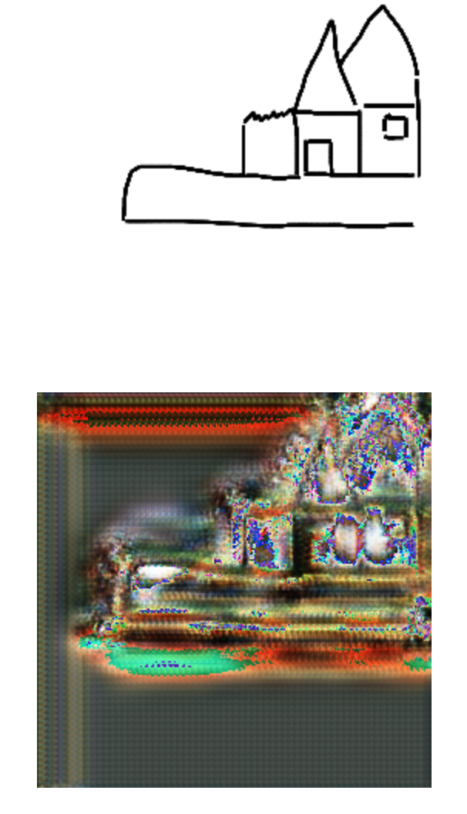
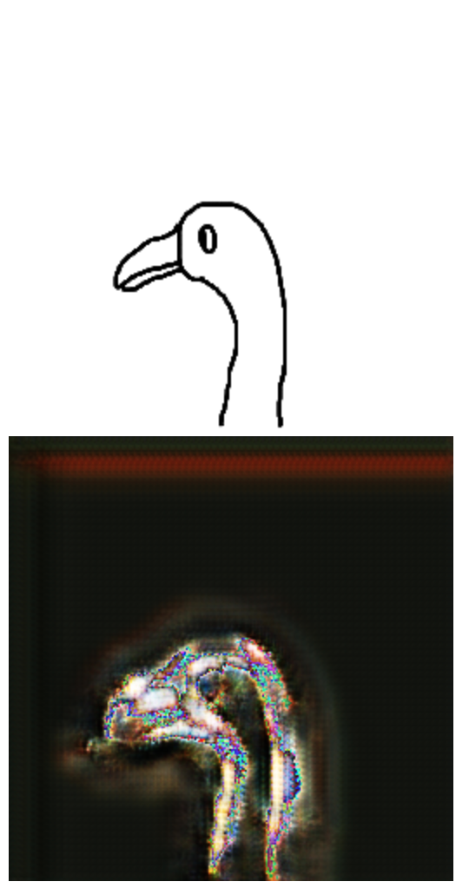

# Generating Photorealistic Images from Sketches using GANs
In this project, we experiment with using GAN models to generate photorealistic images from simple black-and-white sketches. The pix2pix and CycleGAN papers (described below) inspired us to use GAN models to approach this problem.  We tried both a conditional GAN and a CycleGAN model to see how the results would compare.

**VIDEO GOES HERE**

# Introduction
One initial source of inspiration for this problem was this fun [boredpanda article](https://www.boredpanda.com/kid-drawings-things-i-have-drawn-dom/?utm_source=google&utm_medium=organic&utm_campaign=organic) describing how a dad uses photoshop to turn his son's doodles into photo-realistic images.  We thought it would be interesting to see if we could get similar results using deep learning. In addition to getting cool results, the ability to turn simple line sketches into photo-realistic images could potentially help artists create quick brainstorming images, or help people ideate by sketching instead of typing.

# Related Work
We referenced the [Pix2Pix](https://arxiv.org/pdf/1611.07004.pdf) and [CycleGAN](https://arxiv.org/pdf/1703.10593.pdf) papers for this project. Pix2Pix uses conditional GANs to train on pairs of sketches and photos, where the generator learns to output fake photos as the corresponding image to a given sketch.  The second paper uses a Cycle GAN to train on unpaired data, with no information matching the two categories of photos and sketches.  One apparent difference between our project and the Pix2Pix paper is that while our data is paired, there is more variation between the sketches and photos (i.e. our sketches are hand-drawn, not simply an edge detection or tracing).

We also looked at the [Sketchy](https://www.cc.gatech.edu/~hays/tmp/sketchy-database.pdf) and [SketchMan](https://dl.acm.org/doi/abs/10.1145/3394171.3413720) papers, since initially we wanted to do sketch enhancement.  The Sketchy project (which is where we got our dataset from) deals with mapping handdrawn sketches to photos by matching pose and category, with a goal of supporting image retrieval.  The recent SketchMan paper deals with generating professional-looking, colored illustrations from simple black-and-white sketches, using a complex process of different pipelines to perform this sketch enhancement.

# Approach

## Data
Initially, we planned to generate high-quality colored sketches from low-quality black-and-white sketches. As we did more research, we discovered that acquiring data for this purpose would be time-consuming and we wanted to focus more on the training and models for this project rather than data collection. Because of this, we opted to use the Sketchy database to generate photorealistic images from black-and-white sketches.
We used the Sketchy database, which contains photos of objects from different categories, along with black-and-white rough sketches corresponding to the photos. Some examples of categories include airplane, horse, and wheelchair. Although this database seemed to be a manageable size, we ran into a number of problems trying to use it on Google Colab. The database contained over 400,000 files, which maxed out the file limit for Team Drives. While troubleshooting this issue, we realized that the dataset actually contained several transformed versions of the same files. With this in mind, we opted to eliminate the transformed versions of the files, transforming images as part of the data loading process instead.  This allowed us to upload the data into a Shared Drive for use with Google Colab.

## Models
We chose to try a pix2pix (conditional GAN) model and a CycleGAN model, and compare results from both.  We learned from the CycleGAN and pix2pix papers that CycleGAN models are supposed to work well for unpaired data, while the pix2pix model depends on having paired data. Since our data was paired between photos and sketches, we were interested to try both types of models and see the differences in their results.

We hypothesized that training a GAN on a wide variety of types of images might cause it to struggle to learn any one type of image well. In order to test this hypothesis, we experimented with models using the full dataset (across all of the categories) and an individual model for just a few categories.

## Initial Testing
First we wanted to get a feel for what kind of images could be realistically generated using our dataset. To this end, we made a simple DCGAN based on a tutorial in the Pytorch documentation, which generates random images from the photos in our data. The sketches are not considered in this model, and only the photos were used.

### Results

In our initial tests, we noticed the generated images exhibited a grid-like pattern. We increased the number of iterations in order to see if this pattern would go away.

After increasing the number of epochs, the grid pattern was no longer visible, and we were able to generate much better-looking random images.

Curiously, we noticed that loss did not seem to change much between 1000 and 7000 iterations, despite the significant improvement in quality of generated images.

## Pix2Pix model

In our initial results, our discriminator loss kept converging to 0, preventing the generator from learning. In order to counteract this, we increased our kernel size and added noise to the labels. We also experimented with training the generator twice as much as the discriminator, so that it would have time to gain an advantage. These approaches helped slow down the rate at which the discriminator loss converged to 0, or caused the loss to hover around 0.200. However, unfortunately this did not seem to make much of a difference for training overall.

### Results

It seemed like the pix2pix model didn't learn colors very well, as the results are largely just a modified version of the sketch.

## CycleGAN model

With both of our models, we had an issue where our image results were all black.  We hypothesized that perhaps our model wasn't learning anything because of the large variation in the dataset, or that it was having trouble mapping between black-and-white and colored input.  However, while running the CycleGAN model, we realized that the output values had to be scaled by 255 in order to get the image result to show up with colors.  

### Results

Although colors and basic form showed up in the output images, the results are far from photorealistic.  The colors are pretty blown-out and saturated.  With more training time, we could probably achieve better results with the model.  However, the CycleGAN still seems to give better results than the Pix2pix model, since the images have more color and seem to be more influenced by training with the photos.

## Roadblocks and Responses

We ran into quite a few issues while training our models. Our discriminator loss was converging to 0, so we experimented with training the generator twice as much as discriminator. We also tried training the generator and discriminator with a 5:1 ratio, since the generator was harder to train.  However, even with this staggered training the generator loss was still pretty stagnant and the discriminator loss also didn't improve much.  We think this might be because our sketch data was so sparse which made it difficult for the generator to learn and train.

Another issue was getting completely black output from our models.  We were stuck trying to figure out this issue for a while, hypothesizing that it was because of our input or because our model wasn't learning anything. Eventually while training the CycleGAN we discovered that we were truncating values when we should have been converting the float output values to a 255 scale.  Once we made this change, we were able to get some color output.  However, the colors are still very saturated and blown-out. We think that if ran our training for longer, we could achieve better-looking results.

We also think that because the sketch input was not closely tied to the photos (i.e. handdrawn instead of an edge tracing), it made it more difficult for the GANs to learn features and the mapping between the sketches and photos.  In the pix2pix paper, for example, they use clean outline edges for matching photos, rather than rough sketches.  It would be interesting to try running these models with more closely matched data to see if we could get better results.

# Discussion
In conclusion, we realized that we may have overestimated our goals given our time constraints and limited experience with GANs.  We learned that GANs are tricky to train and troubleshoot, and that data collection and parsing is a really important and time-consuming part of the project.  We were excited to try a few different models on our data and compare them, but we were disappointed with our lack of reasonable results.  If we did this project again, we would definitely make some changes such as choosing a more targeted dataset (fewer categories and more examples with slight variation) or just try training a single model in order to focus our project and allow more time for debugging and troubleshooting.  We think that this approach would at least give us a clearer path for our project, even if it wouldn't specifically solve the problems we encountered here.
