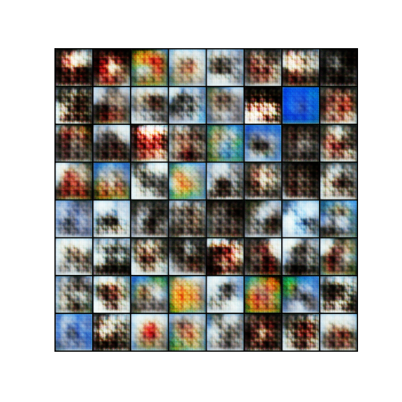
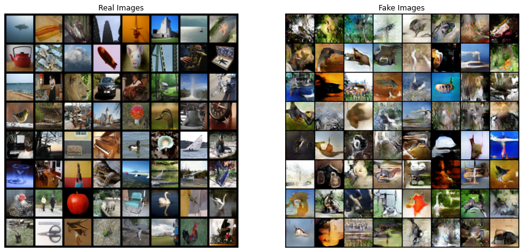
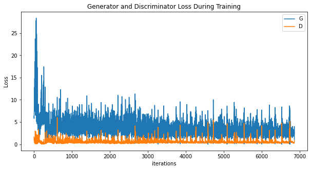

# Generating Photorealistic Images from Sketches using GANs
In this project, we experiment with using GAN models to generate photorealistic images from simple black-and-white sketches. The pix2pix and CycleGAN papers (described below) inspired us to use GAN models to approach this problem.  We tried both a conditional GAN and a CycleGAN model to see how the results would compare.  We were able to achieve **___ accuracy/loss blah blah numbers** when generating these images.

**VIDEO GOES HERE**

# Introduction
One initial source of inspiration for this problem was this fun [boredpanda article](https://www.boredpanda.com/kid-drawings-things-i-have-drawn-dom/?utm_source=google&utm_medium=organic&utm_campaign=organic) describing how a dad uses photoshop to turn his son's doodles into photo-realistic images.  We thought it would be interesting to see if we could get similar results using deep learning. In addition to getting cool results, the ability to turn simple line sketches into photo-realistic images could potentionally help artists create quick brainstorming images, or help people ideate by sketching instead of typing.

# Related Work
We referenced the [pix2pix](https://arxiv.org/pdf/1611.07004.pdf) and [CycleGAN](https://arxiv.org/pdf/1703.10593.pdf) papers for this project.  
* SketchMan paper
* Sketchy paper
* Pix2Pix paper
* CycleGAN paper

# Approach

## Data
Initially, we planned to generate high-quality colored sketches from low-quality black-and-white sketches. As we did more research, we discovered that acquiring data for this purpose would be time-consuming and we wanted to focus more on the training and models for this project rather than data collection. Because of this, we opted to use the Sketchy database to generate photorealistic images from black-and-white sketches.
We used the Sketchy database, which contains photos of objects from different categories, along with black-and-white rough sketches corresponding to the photos. Although this database seemed to be a manageable size, we ran into a number of problems trying to use it on Google Colab. The database contained over 400,000 files, which maxed out the file limit for Team Drives. While troubleshooting this issue, we realized that the dataset actually contained several transformed versions of the same files. With this in mind, we opted to eliminate the transformed versions of the files, transforming images as part of the data loading process instead.  This allowed us to upload the data into a Shared Drive for use with Google Colab.

## Models
We chose to try a pix2pix (conditional GAN) model and a CycleGAN model, and compare results from both.  We learned from the CycleGAN and pix2pix papers that CycleGAN models are supposed to work well for unpaired data, while the pix2pix model depends on having paired data. Since our data was paired between photos and sketches, we were interested to try both types of models and see the differences in their results.

We hypothesized that training a GAN on a wide variety of types of images might cause it to struggle to learn any one type of image well. In order to test this hypothesis, we created a few different models for both pix2pix and CycleGAN:
* a model using the full dataset (across all of the categories)
* an individual model for just a few categories

## Initial Testing
First we wanted to get a feel for what kind of images could be realistically generated using our dataset. To this end, we made a simple DCGAN based on a tutorial in the Pytorch documentation, which generates random images from the photos in our data. The sketches are not considered in this model.

## Results

In our initial tests, we noticed the generated images exhibited a grid-like pattern. We increased the number of iterations in order to see if this pattern would go away.

After increasing the number of epochs, the grid pattern was no longer visible, and we were able to generate much better-looking random images.

Curiously, we noticed that loss did not seem to change much between 1000 and 7000 iterations, despite the significant improvement in quality of generated images.
## Sketch-to-Image results
## Pix2Pix models

### Full Dataset
In our initial results, our discriminator loss kept converging to 0, preventing the generator from learning. In order to counteract this, we increased our kernel size and added noise to the labels. We also experimented with training the generator twice as much as the discriminator, so that it would have time to gain an advantage. These approaches helped slow down the rate at which the discriminator loss converged to 0, or caused the loss to hover around 0.200. However, unfortunately this did not seem to make much of a difference for training overall.

### Single Category

## CycleGAN model

### Full Dataset

### Single Category

# Discussion
In conclusion ...
